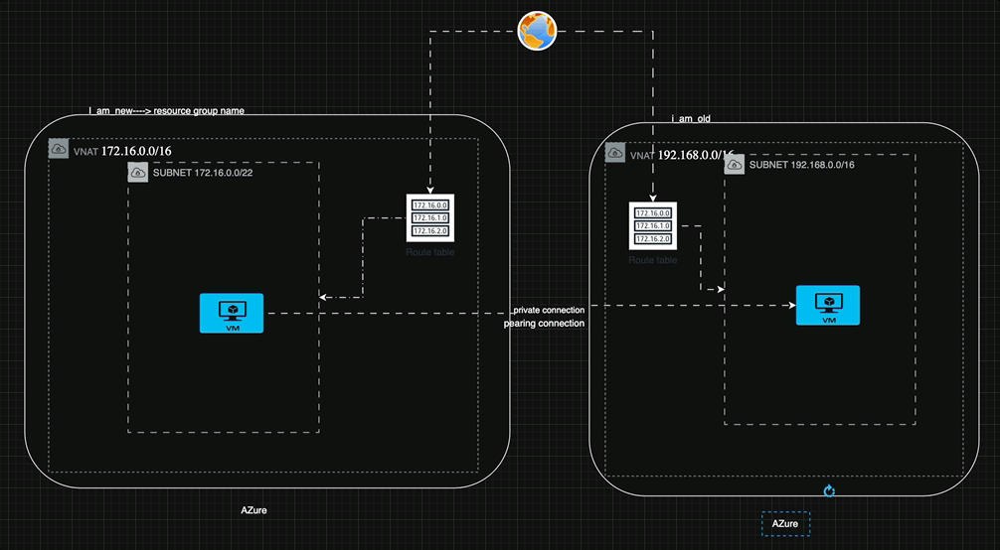

## Azure VNet Peering

### What is VNet Peering?
<cite index="56-1">Virtual network peering connects virtual networks across regions using the Azure backbone network</cite> — allowing resources in different VNets to communicate as if they were on the same network, **without traffic going over the public internet**.

### Key Rules and Facts
- <cite index="53-1">Both VNets must not contain any overlapping IP address spaces</cite>
- <cite index="52-1">Peering requires connections in both directions — you must create a peering connection from VNet A to VNet B, and a reciprocal connection from VNet B back to VNet A; peering is not active until both connections show a **Connected** status</cite>
- <cite index="53-1">Once peered, the networks appear as one network for communication purposes, and all VNet-to-VNet traffic happens over Azure's internal network rather than the internet</cite>
- <cite index="53-1">VNet peering does NOT support transitive/cascading routing — if VNet A peers with VNet B, and VNet B peers with VNet C, that does NOT mean VNet A can reach VNet C</cite> (this is a very common exam/interview question!)
- <cite index="56-1">Each peered VNet can still have its own gateway to connect to an on-premises network, or use gateway transit to share a gateway across peered VNets</cite>

### Peering Configuration Options
When setting up a peering connection, you configure:

| Setting | What It Controls |
|---|---|
| **Allow traffic to remote VNet** | Whether local VNet resources can send traffic to the peered VNet |
| **Allow forwarded traffic** | <cite index="54-1">Whether traffic forwarded from a remote VNet (not originating there) can pass through</cite> |
| **Allow gateway transit** | <cite index="55-1">Whether the peered VNet can use this VNet's VPN/ExpressRoute gateway</cite> |

### Common Architecture: Hub-and-Spoke
<cite index="56-1">Virtual network peering enables the next hop in a User-Defined Route (UDR) to be the IP address of a VM in the peered VNet or a VPN gateway</cite> — this is the foundation of the popular **hub-and-spoke** topology, where a central "hub" VNet (containing shared services like a firewall or gateway) peers with multiple "spoke" VNets (containing workloads).

📘 **Official Docs:**
- [Virtual network peering overview – Microsoft Learn](https://learn.microsoft.com/en-us/azure/virtual-network/virtual-network-peering-overview)
- [Create, change, or delete Azure VNet peering – Microsoft Learn](https://learn.microsoft.com/en-us/azure/virtual-network/virtual-network-manage-peering)



## Network Security Groups (NSG): Rules and Priorities

### What is an NSG?
A **Network Security Group (NSG)** is <cite index="77-1">Azure's built-in firewall for your virtual network — a list of rules that say "allow this traffic" or "deny this traffic," evaluated in priority order.</cite> NSGs <cite index="71-1">control network traffic flow by filtering traffic in and out of virtual network subnets and network interfaces.</cite>

### Where NSGs Can Be Attached
| Attachment Level | Effect |
|---|---|
| **Subnet** | Applies to **every** resource inside that subnet |
| **Network Interface (NIC)** | Applies to **only** that specific VM/resource |
| **Both** | Traffic must pass **both** NSGs — the most restrictive result wins |

### The Five-Tuple
<cite index="69-1">Security rules are evaluated and applied based on the five-tuple information of source, source port, destination, destination port, and protocol.</cite>

### Rule Properties
<cite index="77-1">Each rule specifies: Direction (Inbound or Outbound), Priority (a number from 100 to 4096, where lower numbers are evaluated first), Protocol (TCP, UDP, ICMP, ESP, AH, or Any), Source/Destination, and Action (Allow/Deny).</cite>

### How Evaluation Works — The Core Rule to Teach
<cite index="70-1">Azure evaluates rules in priority order: lowest number (highest priority) first. When traffic matches a rule, processing stops — Azure doesn't evaluate further rules.</cite>

```
Rule Priority 100  → Evaluated FIRST
Rule Priority 200  → Evaluated if 100 didn't match
Rule Priority 500  → Evaluated if 100 & 200 didn't match
   ...
Default Rules (65000+) → Evaluated LAST, if nothing else matched
```

### Default Rules
<cite index="71-1">When you create an NSG, Azure automatically creates several default security rules. You can't delete default rules, but you can override them by creating custom rules with priority numbers between 100 and 4096.</cite>

**The 3 built-in defaults (approximate priorities):**
| Default Rule | Priority | Effect |
|---|---|---|
| **AllowVNetInBound** | 65000 | <cite index="76-1">Allow traffic within a Virtual Network</cite> |
| **AllowAzureLoadBalancerInBound** | 65001 | Allow Azure's load balancer health probes |
| **DenyAllInBound** | 65500 | <cite index="73-1">Blocks all inbound traffic not matched by a higher-priority allow rule</cite> |
| **AllowVNetOutBound / AllowInternetOutBound** | 65000-65001 | <cite index="76-1">Allow outbound to the internet and within the VNet</cite> |
| **DenyAllOutBound** | 65500 | Denies all other outbound traffic |

### Creating NSG Rules

### Best Practice — Priority Spacing
<cite index="74-1">Start your first rule with a priority like 110 instead of 100, giving yourself flexibility to insert another rule that needs to run before it later, without renumbering everything.</cite>

📘 **Official Docs:** [Azure network security groups overview – Microsoft Learn](https://learn.microsoft.com/en-us/azure/virtual-network/network-security-groups-overview)

## Service Tags and Application Security Groups

### Service Tags
<cite index="79-1">A service tag represents a group of IP address prefixes from a given Azure service. Microsoft manages the address prefixes and automatically updates the service tag as addresses change, minimizing the complexity of frequent updates to network security rules.</cite>

**Key facts:**
- <cite index="78-1">You can't create your own service tag or specify which IP addresses are included</cite> — they're fully managed by Microsoft
- <cite index="79-1">You can use service tags to define network access controls on NSGs, Azure Firewall, and user-defined routes</cite>
- <cite index="79-1">By default, service tags reflect ranges for the entire cloud, but some also allow regional scoping</cite> — e.g., <cite index="79-1">`Storage` represents Azure Storage across the entire cloud, while `Storage.WestUS` narrows it to only West US storage IP ranges</cite>

### Common Service Tags

| Service Tag | Represents |
|---|---|
| `VirtualNetwork` | <cite index="74-1">The entire VNet address range (including peered VNets and on-premises via VPN/ExpressRoute)</cite> |
| `Internet` | <cite index="74-1">All external IP addresses that are publicly routable</cite> |
| `AzureLoadBalancer` | Azure's internal load balancer health-probe traffic |
| `Storage` | Azure Storage service IP ranges |
| `Sql` | Azure SQL Database / Data Warehouse ranges |
| `AzureCloud` | All Azure public IP ranges — <cite index="79-1">generally not recommended for inbound allow rules, since it includes IPs used by other Azure customers too</cite> |

### Why Use Service Tags Instead of IP Addresses?
<cite index="74-1">Using tags in your source and destination fields enhances the readability of your NSG rules</cite> and — more importantly — Azure keeps them updated automatically as the underlying service IPs change, so you never have a rule silently break because Microsoft rotated an IP range behind the scenes.

> ⚠️ Caution: <cite index="79-1">Service tags alone aren't sufficient to fully secure traffic — always consider the actual nature of the service and traffic before relying solely on a tag-based rule.</cite>

### Application Security Groups (ASGs)
<cite index="70-1">Application security groups let you group network interfaces by role, so you can write NSG rules that reference logical groups instead of individual IP addresses.</cite>

**Rules for ASGs:**
- <cite index="70-1">All network interfaces in an ASG must exist in the same virtual network as the first NIC assigned to it</cite>
- <cite index="70-1">If you reference ASGs in both the source and destination of a rule, the NICs in both groups must be in the same virtual network</cite>
- <cite index="70-1">You can reference up to 10 ASGs in a single rule's source or destination</cite>

### ASG Example — Real Scenario
<cite index="75-1">By using ASGs, you can group VMs that provide the same application functionality — for example, `AsgWeb` for web servers, `AsgLogic` for business-logic servers, and `AsgDb` for database servers.</cite> An NSG rule set might look like:

| Rule Name | Source | Destination | Port | Action |
|---|---|---|---|---|
| Allow-HTTP-Inbound-Internet | `Internet` | `AsgWeb` | 80, 443 | Allow |
| Allow-Database-BusinessLogic | `AsgLogic` | `AsgDb` | 1433 | Allow |
| Deny-Database-All | `*` | `AsgDb` | * | Deny |

<cite index="75-1">This demonstrates how administrators can use ASGs to simplify NSG rule management — using one NSG with logical role-based groups instead of maintaining separate rules per IP address.</cite> As VMs scale up/down or get new IPs, you simply add/remove them from the ASG — **no rule editing required.**


📘 **Official Docs:**
- [Azure service tags overview – Microsoft Learn](https://learn.microsoft.com/en-us/azure/virtual-network/service-tags-overview)
- [Network security groups and application security groups – Microsoft Learn](https://learn.microsoft.com/en-us/azure/networking/design-guide/network-application-security-groups)


### C) Effective Security Rules
<cite index="85-1">Effective security rules shows you all security rules applied to a network interface — both the NIC-level rules and the subnet-level rules — plus the aggregate/combined result of both.</cite> This is essential because, as discussed in Section 1, **traffic must pass both NIC and subnet NSGs.**

### Common Real-World NSG Misconfigurations (Great Teaching Scenarios)

| Symptom | Likely Cause | Fix |
|---|---|---|
| **No custom deny rule exists, but traffic is still blocked** | <cite index="73-1">The default `DenyAllInBound` rule (priority 65500) is blocking traffic not matched by any higher-priority allow rule</cite> | <cite index="73-1">Add an explicit allow rule with a priority number lower than 65500</cite> |
| **One NSG allows, another NSG on the same path denies** | <cite index="89-1">Conflicting rules between the subnet-level NSG and the NIC-level NSG</cite> | <cite index="89-1">Remove the conflicting deny rule, or lower the priority number of the allow rule so it takes precedence</cite> |
| **Subnet NSG allows SSH, but VM still unreachable** | <cite index="89-1">The NIC-level NSG has the default `DenyAllInBound` rule and no explicit SSH allow rule of its own</cite> | <cite index="89-1">Use the Effective security rules view to see the combined rules, then add matching allow rules at both levels</cite> |
| **Bastion can't reach a VM (from Day 5!)** | <cite index="91-1">A `DenyVnetInBound` rule is denying traffic from the `VirtualNetwork` service tag, which includes the Bastion subnet's IP range</cite> | <cite index="91-1">Add a higher-priority rule that explicitly allows traffic from the Bastion subnet's specific address range</cite> |

📘 **Official Docs:**
- [Azure Network Watcher overview – Microsoft Learn](https://learn.microsoft.com/en-us/azure/network-watcher/network-watcher-overview)
- [IP flow verify overview – Microsoft Learn](https://learn.microsoft.com/en-us/azure/network-watcher/ip-flow-verify-overview)
- [Troubleshoot NSG misconfigurations – Microsoft Learn](https://learn.microsoft.com/en-us/troubleshoot/azure/virtual-network/virtual-network-troubleshoot-nsg-blocking-traffic)
